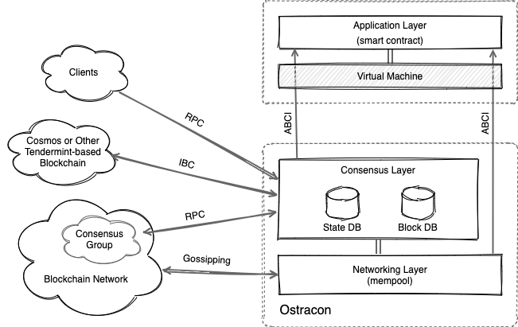

# Ostracon: A Fast, Secure Consensus Layer for The Blockchain of New Token Economy

Version 1.0 :: [English](index.md)

## Ostracon Overview

Ostracon は LINE Blockchain エコシステムにビザンチン障害耐性を持つ分散合意メカニズムを提供するコアコンポーネントです。アプリケーションが
実行するトランザクションの順序を確定し、トランザクションのコンテナであるブロックの生成、検証を行います。

LINE Blockchain はインターネット上の電子サービスのみならず、金融や産業にも適用可能な合意メカニズムをもたらすために技術選定について達成
すべきいくつかの方針を設定しています。

1. **セキュリティ**: 暗号理論に基づいた実用に十分な完全性と健全性を持つ。
2. **整合性**: 強い整合性 (ファイナリティ) の合意アルゴリズムを持つ。
3. **障害耐性**: ビザンチン障害を含むシステム障害に対して Safety と Liveness を持つ。
4. **パフォーマンスとスケーラビリティ**: 1000TPS+ の速度性能を持つ。
5. **チェーン間接続**: LINE Blockchain 以外のブロックチェーンとの相互接続性を持つ。

ファイナリティとパフォーマンスの観点から Bitcoin のような Proof of Work よりも BFT (Byzantine Fault-Tolerance) に基づく P2P
合意アルゴリズムの方が適しています。中でもブロックチェーンに最適化された近代的な設計が行われている Tendermint-BFT は我々の方針に最も
近い実装でした (さらに良いことに Cosmos Hub とも接続できます)。

我々は我々のブロックチェーンをさらに改善するために Tendermint-BFT に二つの新しい暗号技術を導入しています。その一つである**検証可能な
疑似乱数** (VRF) は、ブロックを生成する Proposer ノードの選出にランダム性をもたせて未来の選出を予測困難にすることを目的に導入されました。
このランダム性の導入により、悪意を持つ攻撃者に攻撃の猶予を与えたり、将来のある時点を狙って参加者どうしで共謀することを困難にする効果が期待
できます。

もう一つの機能は **BLS 署名**です。双線形写像に基づく BLS 署名は複数の電子署名をたった一つの電子署名に集約できる特徴を持ちます。多くの
ブロックチェーンプロトコルでは、ブロックを承認するために多数の署名を保存しなければなりませんが、BLS 署名集約を有効にすることでそのフット
プリントを削減し、通信速度やストレージ消費量を大きく改善する効果が期待できます。

## Layered Structure

LINE Blockchain ノードを構成する Application, Consensus および Networking の 3 つのレイヤーのうち、Ostracon には Consensus と
Networking レイヤーが含まれています。

まだブロックに取り込まれていないトランザクションは mempool と呼ばれる Network レイヤーのアンチエントロピー機構 (ゴシッピング) によって
各ノード間で共有されます。ここで、Network および Consensus レイヤーではトランザクションを単純なバイナリとして扱い、そのデータの内容には
関与しません。

## Specifications and Technology Stack

| Specifications        | Policy / Algorithms           | Methods / Implementations                       |
|:----------------------|:------------------------------|:------------------------------------------------|
| Participation         | Permissioned                  | Consortium or Private                           |
| Election              | Proof of Stake                | VRF-based Weighted Sampling without Replacement + SplitMix64 |
| Agreement             | Strong Consistency w/Finality | Tendermint-BFT                                  |
| Signature             | Elliptic Curve Cryptography   | Ed25519, *BLS12-381**1               |
| Hash                  | SHA2                          | SHA-256, SHA-512                                |
| HSM                   | *N/A*                         | *No support for VRF or signature aggregation*   |
| Key Auth Protocol     | Station-to-Station            | |
| Tx Sharing Protocol   | Gossiping                     | mempool |
| Application Protocol  | ABCI                          | |
| Interchain Protocol   | IBC (Cosmos Hub)              | |
| Storage               | Embedded KVS                  | LevelDB |
| Message Recovery      | WAL | |

*1 experimental implementation.

## Ostracon Features

* [Extending Tendermint-BFT with VRF-based Election](consensus_ja.md)
* [BLS Signature Aggregation](signature_aggregation_ja.md)
