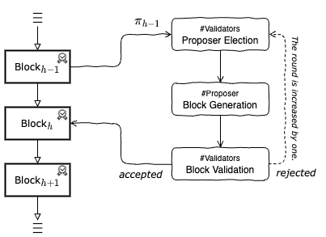
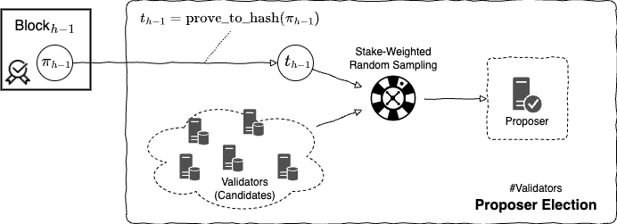
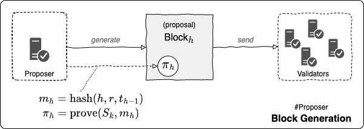
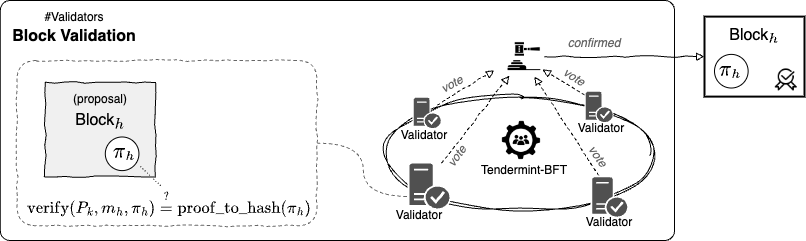
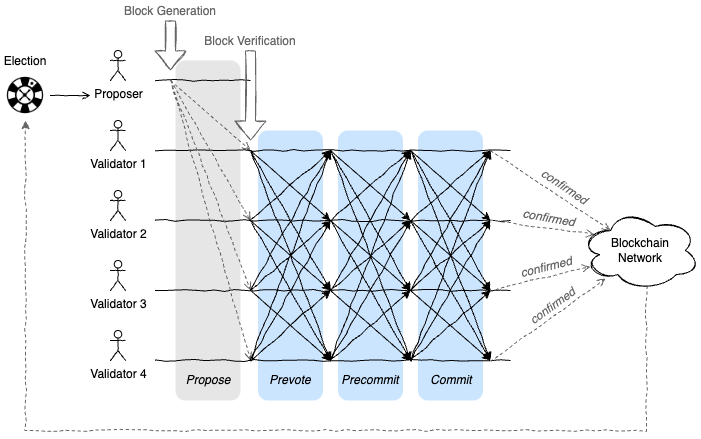

Ostracon is extending Tendermint-BFT with VRF-based election.

## Consensus process

Ostracon's Tendermint-BFT based block generation mechanism consists of three phases. We here refer to the generation of blocks as **height**, and a single approval round consisting of the following three processes as **round**.

### Election

Elect a proposer from the set of validator (candidate) nodes. This is the same as a leader election in a general distributed system. However, in a blockchain, it must be designed to prevent artificial selection so that malicious interference doesn't degrade the overall performance of the system. Also note that there is no centralised authority is involved in the Ostracon election to ensure fairness. Since all nodes can compute the election results deterministically, each node can autonomously determine whether it has been elected as a proposer.

### Block generation

The selected proposer proposes a block. The unconfirmed transactions that have not yet been added in the blockchain are shared via P2P between the nodes nodes in the network and stored in an area of each node called the mempool. The node selected as the proposer generates a block from the unconfirmed transactions remaining in its mempool and proposes it to the validators.

### Block verification

The validators validate the block proposed by the proposer. Each validator votes on whether the block is correct, and Tendermint-BFT replicates the votes to the other validators. If more than $\frac{2}{3}$ of all validators vote in favor of the block, the block is officially approved. On the other hand, if a quorum is not reached, the proposed block is rejected, and a new round of elections or voting is started over.

> TIP: In Tendermint-BFT, this re-election process can be routed to a particular stage of the election process, depending on reasons for rejection.



## VRF-based proposer election

VRF is an algorithm for generating a hash value $t$ that can be used as a cryptographic pseudorandom number. The difference between VRF and typical hash functions or pseudorandom number generators is that only the owner of the private key can generate the hash value $t$, and anyone with the corresponding public key can verify the correctness of the hash value.

A VRF hash generator $k$ generates a proof $\pi$ (VRF Proof) from the message $m$ using its private key $S_k$ as in equation `1.`. Here the hash value $t$ can be obtained from the proof $pi$ using equation. `2.` On the other hand, to verify that the hash value $t$ was generated by the owner of the private key $S_k$ based on the message $m$, the verifier applies the public key $P_k$ for $S_k$, $m$, and $\pi$ to equation `3.` to verify that both hash values are identical.

1. $\pi = {\rm vrf\\_prove}(S_k, m)$
2. $t = {\rm vrf\\_proof\\_to\\_hash}(\pi)$
3. ${\rm vrf\\_proof\\_to\\_hash}(\pi) \overset{\text{?}}{=} {\rm vrf\\_verify}(P_k, m, \pi)$

In Ostracon, the proposer of the next block is randomly selected by a verifiable random number from the proposer who created the previous block. A VRF Proof field $\pi$ is added to the block for this purpose.

The node receiving the new block starts the election phase. In this phase, it verifies the VRF Proof $\pi$ contained in the block, computes the VRF hash $t$, which is a "fair pseudorandom number", and selects the proposer for this round based on this value. This is done by a simple and fast weighted random sampling based on the probability of selection according to Stake holdings (in other words, based on PoS).



The node selected as proposer by at this phase takes the unapproved transactions from its own mempool and generates a proposal block (at this point the block is not yet confirmed). The proposer then computes the VRF Proof $\pi'$ using the previous VRF Hash $t$ that selected it, the new block height $h$ and the current round $r$, and sets it to the block.

```math
\begin{eqnarray*}
m_h & = & {\rm SHA256}(h \,\|\, r \,\|\, t_{h-1}) \\
\pi_h & = & {\rm vrf\_prove}(S_i, m_h) \\
t_h & = & {\rm vrf\_proof\_to\_hash}(\pi_h)
\end{eqnarray*}
```

Note that the message $m$ used to compute the new VRF Proof $\pi$ doesn't include the hash value of the block itself. We believe that the hash value of the block is inherently insecure, because the proposer generating the block can obtain a favorable value by trial and error.



A validator checks the received Proposal block and votes on it. The votes are replicated by Tendermint-BFT through prevote, precommit, and commit. The block is confirmed if more than a quorum of valid votes are collected.



During the verification phase, in addition to the block verification, the following VRF-related verifications are performed:

* The proposer that generated the block must be a node selected based on the VRF hash of its previous block. This can be determined by matching the node that actually generated the block with the proposer selected by weighted random sampling using the VRF hash $t$.
* The $\pi$ contained in the block must be a VRF Proof generated using the proposer's private key. If the $t$ computed from the VRF Proof $\pi$ matches the $t$ computed by the `vrf_verify()` function, we can conclude that $\pi$ is not forged.

 ```math
{\rm vrf\_verify}(P_i, m_h, \pi_h) \overset{\text{?}}{=} {\rm vrf\_proof\_to\_hash}(\pi_h)
```
By repeating this sequence of rounds, fair random sampling can be chained across all block generations.



Recall that the node receiving the block can deterministically calculate which node is the next proposer. By revealing the nodes responsible for generating blocks in a given round, we can penalise nodes that are elected but don't actually do their job, or that behave maliciously, such as in Eclipse attacks. On the other hand, it's still difficult to predict the proposer beyond one block, as they are only revealed for the minimum time necessary.

## Failure handling

### Disciplinary scheme

Although Ostracon's consensus scheme works correctly even if a few nodes fail, it's ideal that failed nodes aren't selected for the consensus group to avoid wasting network and CPU resources. In particular, for cases such as intentional malpractice, not caused by general asynchronous messaging problems, evidence of the behavior will be shared, and action will be taken to eliminate the candidate from the selection process by forfeiting the stake, whether malicious or not.

### Recovery

In a system with such a disciplinary rule, it's important to have a mechanism to prevent nodes from causing unintended behavior; Ostracon saves all received messages in its WAL (write-ahead log), and when it recovers from a node failure, it can correctly apply processing after the last message it applied.

For more information on WAL, see [Tendermint | WAL](https://github.com/tendermint/tendermint/blob/v0.34.x/spec/consensus/wal.md).
