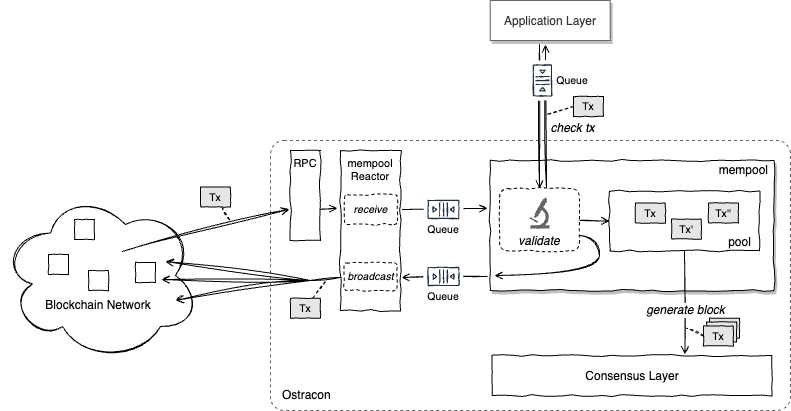

A client application can send a transaction to any Ostracon nodes that join the blockchain network. The transaction propagates to other Ostracon nodes and is ultimately shared by all Ostracon nodes.

## Mempool

<!-- Once a block is accepted by the Ostracon consensus mechanism, the transactions contained in that block are considered **confirmed**.  -->
Unconfirmed transactions are validated and stored in an area called [**mempool**](https://github.com/tendermint/tendermint/blob/v0.34.x/spec/abci/apps.md#mempool-connection), separated from the block storage, after checking length, content, and so on.
> Tip: Mempool has a limited size; transactions can be rejected to store if the size of mempool reaches the limit.

The unconfirmed transactions stored in the mempool by an Ostracon node are broadcast to other Ostracon nodes. However, if the transaction has already been received or is invalid, it's neither stored nor broadcast but discarded. Such a method is called **gossipping** (or flooding). A transaction will reach all nodes at a rate of $O(\log N)$ hops, where $N$ is the number of nodes in the Ostracon network.

The Ostracon node selected as a proposer by [election](02-consensus.md#election) generates a new proposal block from transactions stored in its mempool. The following figure shows the flow of an Ostracon node from receiving an unconfirmed transaction and storing it in the mempool until it's used to generate a block.

## Performance and asynchronization

Blockchain performance tends to focus on the speed of block generation, but in a practical system, the efficiency of sharing transactions among nodes is also an important factor that significantly affects overall performance. For the high speed of Gossipping's network propagation, Ostracon's mempool must process a large number of transactions in a short period. <!-- in exchange for Gossipping's network propagation speed.-->
To this end, Ostracon has added several queues to the Tendermint's **Reactor** implementations to make all P2P messages, include transactions, processed asynchronously. This asynchronization allows the transaction sharing on nodes with modern CPU cores to process more transactions in the mempool in a shorter time, improving network throughput limits.

With this asynchronization of the mempool, multiple transactions will be in a **validation-processing** state at the same time; asynchronous validation-processing transactions are also correctly included in the calculation of the mempool capacity. Therefore, Ostracon will still refuse to receive transactions when the mempool capacity is exceeded.

## Transaction validation via ABCI

ABCI (Application Blockchain Interface) is a specification for applications to communicate with Ostracon and other tools remotely (via gRPC, ABCI-Socket) or in-process. For more information, see [Tendermint specifications](https://github.com/tendermint/tendermint/tree/main/spec/abci).

The process of validating unconfirmed transactions also queries the application layer via ABCI. This behavior allows the application to avoid including transactions in the block that are essentially unnecessary (although correct from a data point of view). Here, Ostracon has modified the [`CheckTx` request](https://github.com/tendermint/tendermint/blob/main/spec/abci/abci.md#mempool-connection) to be asynchronous, so that the validation process for the next transaction can be started without waiting for the result of the ABCI-side validation. This improves performance in environments where applications are allocated separate CPU cores.

On the other hand, a side effect of this asynchronization is that the application may receive another `CheckTx` request while processing one ABCI request. For example, a check state internally maintained by the [LBM SDK](https://github.com/line/lbm-sdk)'s ABCI application interface ([BaseApp](https://docs.cosmos.network/main/core/baseapp.html)) must have appropriate exclusive control over this concurrency. To allow such locking scope to be properly configured at the application layer, Ostracon's ABCI has added an API that notifies when `RecheckTx` starts and ends.
