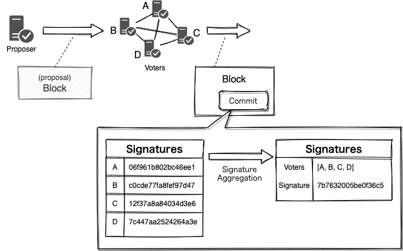

BLS Signature Aggregation

## Overview

Blockchains with a decentralized consensus mechanism need to collect a sufficient number of votes (signatures) each time a block is created. The more participants in a consensus, the more secure it becomes. At the same time however, the more signatures there are, the larger the block size becomes. It takes longer to verify a larger block, and the performance becomes worse as a result. To solve this problem, Bitcoin (BIP340) and Ethereum 2.0 are working to improve performance by incorporating signature aggregation.

The first paper on BLS signatures was published as a digital signature that could be implemented in a very small size. This technique that was called "pairing" has led to several other interesting features, such as threshold signatures and blind signatures. Ostracon also aggregates the multiple signatures into a single one by BLS to improve performance by reducing block size and reducing the number of verifications.

## Public Key Abstraction

With the introduction of BLS signatures, Ostracon has been redesigned to allow signature keys with different schemes per node to be used on the same blockchain instance, which means that Ostracon participants can choose between fast and proven Ed25519 signatures and signature aggregation capable BLS signatures when setting up their nodes. This flexibility gives us the flexibility to test/adopt better signature algorithms in the future, or to deal with vulnerabilities in the implementation if they are discovered.

## Why is this an experimental status?

In introducing BLS, we have unfortunately found that the BLS signature aggregation conflicts in several ways with the design of Tendermint, the base of Ostracon. A typical example is an elementary validation called Light Validation for light nodes. Even if a client doesn't have the public keys of all the nodes involved in the consensus, it can still consider a block to be correct if it successfully validates 2/3+1 of the total number of voters based on the BFT assumption. However, with BLS signatures, if even one of the public keys participating in the consensus is missing, all the aggregated signatures cannot be verified.

In terms of performance, Ed25519 signatures are faster than BLS signatures for generating/verifying a single signature. We consider the point where the block size reduction and the verification frequency reduction outweigh the slowness as a watershed point and are carefully investigating to find it.

| Algorithm         | Private Key | Public Key | Signature | Sig Generation | Sig Verification |
|:------------------|------------:|-----------:|----------:|---------------:|-----------------:|
| ECDSA (secp256k1) |         96B |        64B |       64B |           92μs |            124μs |
| Ed25519           |         64B |        32B |       64B |           49μs |            130μs |
| BLS12-381         |         32B |        96B |       48B |          233μs |          1,149μs |

Table: Space and time efficiency of signature algorithms. The message length for signature creation/verification is 1024 bytes.

We have a plan to support BLS signatures going forward, but considering the backward-incompatible fixes for these issues, this functionality currently has an experimental status.
