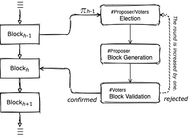
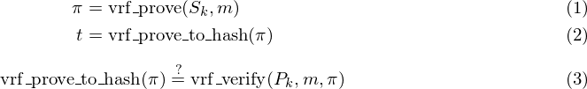
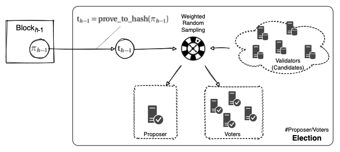
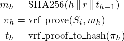
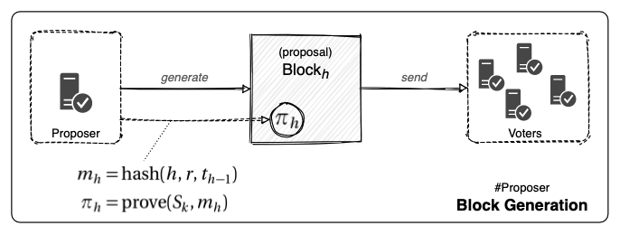
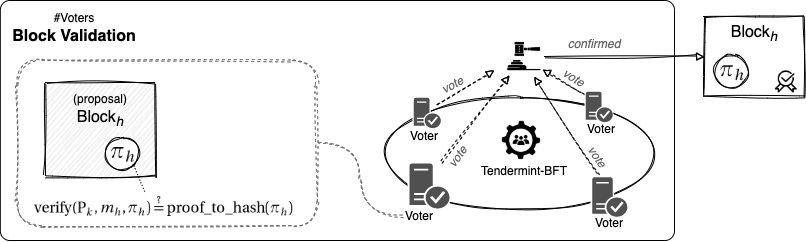
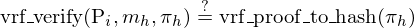
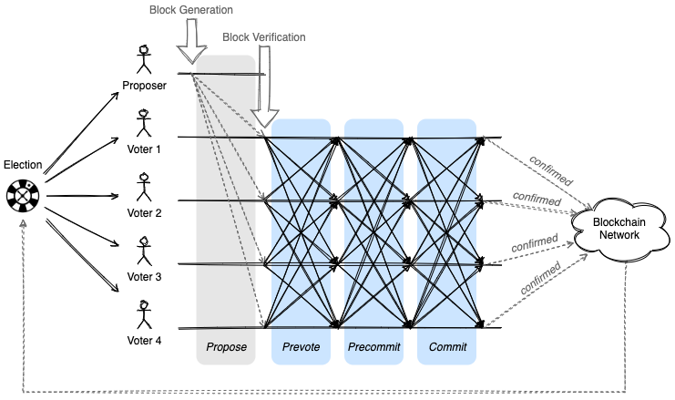

# Extending Tendermint-BFT with VRF-based Election

## Consensus Overview

Tendermint-BFT に基づく Ostracon のブロック生成メカニズムは以下の 3 つのフェーズで構成されています。
ここで、ブロックの世代を*高さ*、この 3 つのブロック承認プロセスを*ラウンド*と呼んでいます。

**選出フェーズ**. 候補ノードの中から １ つの Proposer と複数の Voter を選出します。これは一般的な分散システムにおけるリーダー選挙と同じ
ですが、ブロックチェーンでは悪意を持った妨害によってシステム全体の性能を低下させないために作為的な選出ができないように設計する必要があります。
また公平性を保証するために Ostracon の選挙には中央集権的な機関が介在していないことにも注意してください。選挙結果はすべてのノードで決定論的に
算出できるため、各ノードは「自分が Proposer または Voter に当選しているか」を自律的に判断することができます。

**ブロック作成フェーズ**. ブロックの提案は選挙で選出された Proposer によって行われます。ブロックチェーンに取り込まれていない未承認の
トランザクションは P2P でネットワーク上のノードに共有され、各ノードの mempool と呼ばれる領域に保管されます。Proposer に選ばれたノードは
自分の mempool に残っている未承認のトランザクションからブロックを生成して Voter に*提案*します。

**ブロック検証フェーズ**. Proposer の提案したブロックは選挙で選出された Voter によって正当性が検証されます。各 Voter はブロックの内容が
正しいかどうかを投票し、票は Tendermint-BFT によって他の Voter に複製され、すべての Voter 数の 2/3+1 以上の賛成票が集まればそのブロックは
正式に*承認*されます。反対に、定足数の賛成票が集まらなければ提案されたブロックは拒否され新しいラウンドで選挙または投票からやり直しとなります
(Tendermint-BFT には拒否の理由によってショートカットする経路がいくつかあります)。



## VRF-based Consensus Group Election

VRF は暗号論的疑似乱数として使用できるハッシュ値 $t$ を生成するアルゴリズムです。VRF が一般的なハッシュ関数や疑似乱数生成器と異なるのは、
秘密鍵の所有者のみがハッシュ値 $t$ を算出でき、対応する公開鍵を持つ人であれば誰でもそのハッシュ値の正当性を検証できる点です。

乱数の生成者 $k$ は式 (1) のように自身の秘密鍵 $S_k$ を使ってメッセージ $m$ から証明 (VRF Proof) $\pi$ を生成します。ここでハッシュ値
$t$ は式 (2) を使って証明 $pi$ から生成することができます。一方、検証者はハッシュ値 $t$ が秘密鍵 $S_k$ の所有者によってメッセージ $m$ に
基づいて生成されたものであることを検証するために、$S_k$ に対する公開鍵 $P_k$ と $m$, $\pi$ を式 (3) に適用して同一のハッシュ値 $t$ が
生成されることを確認します。



```math
\begin{eqnarray}
\pi & = & {\rm vrf\_prove}(S_k, m) \\
t & = & {\rm vrf\_proof\_to\_hash}(\pi)
\end{eqnarray}
\begin{equation}
{\rm vrf\_proof\_to\_hash}(\pi) \overset{\text{?}}{=} {\rm vrf\_verify}(P_k, m, \pi)
\end{equation}
```

Ostracon では、あるブロックを作成した Proposer による*無作為で検証可能な乱数*によって次の Proposer と Voter を決定します。そして
ブロックにはそのための VRF Proof フィールド $\pi$ が追加されています。

新しいブロックを受信したノードは選出フェーズを開始します。選出フェーズではブロックに含まれている VRF Proof $\pi$ を検証し、「公正な
疑似乱数」である VRF ハッシュ $t$ を算出し、その値に基づいてこのラウンドの Proposer と Voter を選択します。これは Stake 保有量に
応じた選出確率に基づく (つまり PoS に基づく) シンプルで高速な加重ランダムサンプリングによって行われます。



この判定によって選ばれた Proposer が自分自身であれば、そのノードは mempool から未承認のトランザクションを取り出して proposal ブロックを
作成します (この時点ではまだブロックは確定していません)。このとき、自分を選択した VRF ハッシュ $t$ とブロックの高さ $h$、現在のラウンド
$r$ に基づいて算出した新しい VRF Proof $\pi'$ をブロックに設定します。



```math
\begin{eqnarray*}
m_h & = & {\rm SHA256}(h \,\|\, r \,\|\, t_{h-1}) \\
\pi_h & = & {\rm vrf\_prove}(S_i, m_h) \\
t_h & = & {\rm vrf\_proof\_to\_hash}(\pi_h)
\end{eqnarray*}
```

VRF Proof $\pi$ を算出するためのメッセージ $m$ にはブロックそのもののハッシュ値は関与しないことに注意してください。ブロックのハッシュ値は
ブロックを生成する Proposer が試行錯誤によって有利な値を導出できることから本質的に安全ではないと考えています。



選出フェーズで自分自身が Voter に選ばれたノードは、受信した Proposal ブロックを検証して投票します。票は Tendermint-BFT により
prevote, precommit, commit を経て複製され、定足数以上の有効票が集まればブロックが承認されます。



検証フェーズではブロックの検証に加えて VRF に関連する以下の検証も行われます。

1. ブロックを生成した Proposer がその直前のブロックの VRF Proof に基づいて選ばれたノードであること。これは実際に VRF ハッシュ $t$ を
   使って加重ランダムサンプリングで Proposer を選んでブロックを生成したノードと一致しているかで判断できます。
2. ブロックに含まれている $\pi$ が本当にその Proposer の秘密鍵を使って生成された VRF Proof であること。VRF Proof $\pi$ から算出した
   $t$ と、vrf_verify() 関数を使って算出した $t$ が一致していれば $\pi$ が偽造されたものでないと判断できます。



```math
{\rm vrf\_verify}(P_i, m_h, \pi_h) \overset{\text{?}}{=} {\rm vrf\_proof\_to\_hash}(\pi_h)
```

この一連のラウンドを繰り返すことによって無作為なランダムサンプリングをすべてのブロック生成に渡って連鎖させることができます。



ここで、ブロックを受信したノードは次の Proposer と Voter がどのノードなのかを決定論的に算出できることを思い出してください。あるラウンドで
ブロックの生成や検証の責任を持つノードを明らかにすることによって、選出されながら実際にはその作業を行わなかったり、Eclipse 攻撃のような悪意の
ある行動を行ったノードに対して懲罰を与えることができます。一方で、それらが明らかになるのは必要最小限の期間のみであり、1 ブロックより先の
Proposer や Voter を予測することは依然として困難です。

VRF は現在のところ Ed25519 鍵を使用して実装されています。BLS 署名を選択したとしても VRF の算出を行うために Ed25519 鍵がセットで生成
されます。

## Voters

Ostracon のネットワークでは Stake を保有して Proposer または Voter に選出される可能性のある候補ノードを Validator としています。
Voter は Validator のサブセットであり、2 つの理由で Ostracon に新しく導入された概念です; 一つ目は Voter に選出されたノードへの
報酬配当を調整するため、もう一つは参加可能なノードの信頼ポリシーが異なるネットワークでビザンチンとして想定する比率を調整可能にするためです
(Voter 数が Validator 数と一致する設定では Tendermint と完全に一致します)。

Voter 選出では、一つの VRF ハッシュ $t$ から複数のノードをランダムに選択するために、疑似乱数関数 $r$ を使って $t$ に基づいた乱数列を
生成します。$t$ が既に暗号論的疑似乱数の性質を持つことから、この $r$ は実装がシンプルで変種が発生しづらく、高速で省メモリであることが
より重要です。Ostracon ではこの Voter 選出にシフトレジスタ型と呼ばれる非常に高速な疑似乱数生成アルゴリズムである
SplitMix64 を使用しています。

## Disciplinary Scheme for Failures

Ostracon の合意スキームは少数のノードが故障していても正しく機能しますが、ネットワークや CPU 資源を無駄に消費しないためには故障したノードが
コンセンサスグループに選ばれないことが理想的です。とりわけ一般的な非同期メッセージングの問題が原因ではないケース、つまり意図的に行ったと
思われる不正な行為に対しては (悪意の有無に関わらず) その挙動の evidence が共有されて Stake の没収によって選出候補から排除する措置が
取られます。
