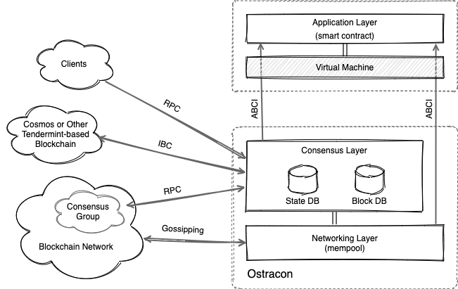

新しいトークンエコノミーのブロックチェーンのための高速で安全なコンセンサスレイヤー

## 概要

Ostracon は LINE Blockchain エコシステムにビザンチン障害耐性 (BFT) を持つ分散合意メカニズムを提供するコアコンポーネントです。これはアプリケーションが実行するトランザクションの順序を確定し、トランザクションのコンテナであるブロックの生成と検証を行います。

LINE Blockchain はこの合意形成の仕組みをインターネット上のサービスだけでなく金融や産業にも適用できるようにするために、技術選定において達成すべきいくつかの方針を次のように定めています。

1. **セキュリティ**: 暗号理論に基づいた実用に十分な完全性と健全性を持つ。
2. **整合性**: 強い整合性 (ファイナリティ) を持つ合意アルゴリズムである。
3. **障害耐性**: ビザンチン障害を含むシステム障害に対して Safety と Liveness を持つ。
4. **パフォーマンスとスケーラビリティ**: 2 秒に 1 つのブロックを生成し、1000TPS+ の速度性能を持つ。
5. **チェーン間接続**: LINE Blockchain 以外のブロックチェーンとの相互接続性を持つ。

BFT に基づく P2P (Peer to peer) コンセンサスアルゴリズムはファイナリティとパフォーマンスの面で Bitcoin のような Proof of Work (PoW) より我々の目的に適しています。中でもブロックチェーンに最適化された近代的な設計の Tendermint-BFT は我々の方針に最も近い実装でした。

我々は、新しいブロックを生成するノードをランダムに選択するために、新しい暗号技術 Verifiable Random Function (VRF) を導入し、Tendermint-BFT ベースのブロックチェーンの改良を行っています。このランダム性は悪意のある攻撃を防ぐのに役立ち、将来のある時点を狙った参加者の共謀を困難にします。

我々の改良によって Ostracon は次の機能をサポートします。詳しくは各ページを参照してください。

* [Extending Tendermint-BFT with VRF-based Election](02-consensus.md)
* [トランザクションの共有](03-tx-sharing.md)

## Ostracon のレイヤー構造

Ostracon は LINE Blockchain のノードを構成する Application, Consensus および Networking の 3 つのレイヤーのうち、Consensus と Networking レイヤーが含まれています。

まだブロックに取り込まれていないトランザクションは [mempool](03-tx-sharing.md) と呼ばれる Network レイヤーのアンチエントロピー機構 (ゴシッピング) によって各ノード間で共有されます。ここで、Network および Consensus レイヤーではトランザクションを単純なバイナリとして扱い、そのデータの内容を解釈しません。

Ostracon のコンセンサスの状態および生成されたブロックはそれぞれ State DB と Block DB に保存されます。これらのストレージはブロック高をキーとする高速なランダムアクセス性能が重視され、特に Block DB は追記が多用されることから、Ostracon では LSMT (Log-Structured Merge Tree) に基づく組み込み型 Key-Value ストアを使用しています。

> Tip: 実際に使用する KVS 実装はビルド時にいくつかの選択肢から決定できます。

## 仕様と技術スタック

| Specifications        | Policy/Algorithms              | Methods/Implementations                                      |
|:----------------------|:-------------------------------|:-------------------------------------------------------------|
| Participation         | Permissioned                   | Consortium or Private                                        |
| Election              | Proof of Stake                 | VRF-based Weighted Sampling without Replacement + SplitMix64 |
| Agreement             | Strong Consistency w/Finality  | Tendermint-BFT                                               |
| Signature             | Elliptic Curve Cryptography    | Ed25519                                                      |
| Hash                  | SHA2                           | SHA-256, SHA-512                                             |
| VRF                   | ECVRF-EDWARDS25519-SHA512-ELL2 | Ed25529                                                      |
| Key Management        | Local KeyStore, Remote KMS     | *HSM is not support due to VRF*                              |
| Key Auth Protocol     | Station-to-Station             |                                                              |
| Tx Sharing Protocol   | Gossiping                      | mempool                                                      |
| Application Protocol  | ABCI                           |                                                              |
| Interchain Protocol   | IBC (Cosmos Hub)               |                                                              |
| Storage               | Embedded KVS                   | LevelDB                                                      |
| Message Recovery      | WAL                            |                                                              |
| Block Generation Time | 2 seconds                      |                                                              |

## 他の合意メカニズムの検討

他のブロックチェーンではどのようなコンセンサス機構を採用しているのでしょうか? Ostracon の方向性を決定するために多くの比較と検討を行いました。

- Bitcoin や Ethereum (v1.10.22 以下) で採用されている **PoW** はブロックチェーンのコンセンサスメカニズムとしてもっとも有名なものです。これらはパブリックチェーンとして運用している実績がありますが、十分な時間が経過しないと整合性が保証されないという構造的な問題が存在します。これは、短期には lost update 問題を引き起こし、長期には性能をスケールできないという問題が顕著に現れることから、PoW は我々の検討の初期段階で選択肢から外されました。

- Tendermint のコンセンサスアルゴリズムである **Tendermint-BFT** はブロックチェーン向けによく考慮された設計です。短時間でファイナリティを保証できる点も我々の方針に適していました。一方、選出アルゴリズムの加重ラウンドロビンは決定論的に機能するため、誰でも将来の Proposer を予測して攻撃を準備することが容易になります。このため Ostracon では VRF を用いて選出を予測不能にすることで Proposer への標的型攻撃の可能性を軽減しています。

- Algorand も VRF を使用していますが我々とは全く異なる方法を採用しています。選挙開始時に各ノードが個別に VRF 乱数を生成し、その番号を用いて次の Validator に当選しているかを判断します (すべてのノードが一斉にコイントスするのと似ています)。これはハッシュ計算によって当選を特定する PoW 方式に比べて計算時間や消費電力を大幅に削減しつつ、暗号論的な安全性を保証することのできる優れた方法です。一方、この方式を LINE Blockchain に適用することはいくつかの理由で困難でした。まず選出される Validator 数が二項分布に従う非決定論的な結果になること。また当選したノード間の相互認識のプロトコルにより複雑さが増します。そして当選したにもかかわらず役割を果たさなかったノードを見つけることができません。

他の合意メカニズムも多数検討しましたが、P2P 分散システムにおける役割選出と合意アルゴリズムとしては現在の選択が最も現実的であると考えています。ただし、Ostracon は特定の研究理論に対する実験的な証明や実証を目的としていないため、将来、より優れたアルゴリズムが提案されればそれを採用する準備があります。
