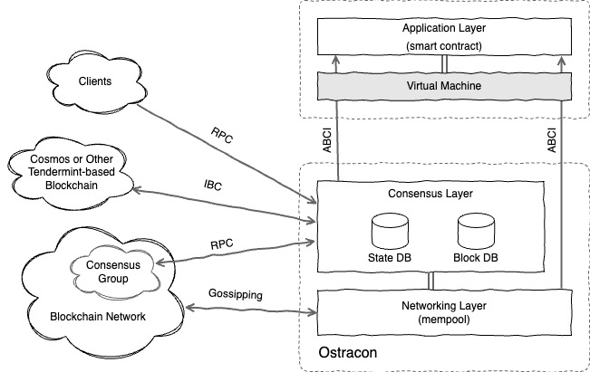

A Fast, Secure Consensus Layer for The Blockchain of New Token Economy

## Ostracon Overview

Ostracon は LINE Blockchain エコシステムにビザンチン障害耐性を持つ分散合意メカニズムを提供するコアコンポーネントです。アプリケーションが
実行するトランザクションの順序を確定し、トランザクションのコンテナであるブロックの生成、検証を行います。

LINE Blockchain はインターネット上の電子サービスのみならず、金融や産業にも適用可能な合意メカニズムをもたらすために技術選定について達成
すべきいくつかの方針を設定しています。

1. **セキュリティ**: 暗号理論に基づいた実用に十分な完全性と健全性を持つ。
2. **整合性**: 強い整合性 (ファイナリティ) の合意アルゴリズムを持つ。
3. **障害耐性**: ビザンチン障害を含むシステム障害に対して Safety と Liveness を持つ。
4. **パフォーマンスとスケーラビリティ**: 2 秒に 1 つのブロックを生成し、1000TPS+ の速度性能を持つ。
5. **チェーン間接続**: LINE Blockchain 以外のブロックチェーンとの相互接続性を持つ。

ファイナリティとパフォーマンスの観点から Bitcoin のような Proof of Work よりも BFT (Byzantine Fault-Tolerance) に基づく P2P
合意アルゴリズムの方が適しています。中でもブロックチェーンに最適化された近代的な設計が行われている Tendermint-BFT は我々の方針に最も
近い実装でした (さらに良いことに Cosmos Hub とも接続できます)。

我々は我々のブロックチェーンをさらに改善するために Tendermint-BFT に新しい暗号技術を導入しています。この **検証可能な疑似乱数** (VRF) は
ブロックを生成する Proposer ノードの選出にランダム性をもたせて未来の選出を予測困難にすることを目的に導入されました。このランダム性の導入により、
悪意を持つ攻撃者に攻撃の猶予を与えたり、将来のある時点を狙って参加者どうしで共謀することを困難にする効果が期待できます。

## Layered Structure

LINE Blockchain ノードを構成する Application, Consensus および Networking の 3 つのレイヤーのうち、Ostracon には Consensus と
Networking レイヤーが含まれています。

まだブロックに取り込まれていないトランザクションは [mempool](03-tx-sharing.md) と呼ばれる Network レイヤーのアンチエントロピー機構
(ゴシッピング) によって各ノード間で共有されます。ここで、Network および Consensus レイヤーではトランザクションを単純なバイナリとして扱い、
そのデータの内容には関与しません。

Ostracon のコンセンサスの状態は State DB に、生成されたブロックは Block DB にそれぞれ保存されます。これらのストレージはブロック高をキーと
する高速なランダムアクセス性能が重視され、特に Block DB は追記が多用されることから Ostracon では LSMT (Log-Structured Merge Tree) に
基づく Embedded Key-Value ストアを使用しています (実際に使用する KVS 実装はいくつかの選択肢からビルド時に決定できます)。

## Specifications and Technology Stack

| Specifications        | Policy / Algorithms            | Methods / Implementations                                    |
|:----------------------|:-------------------------------|:-------------------------------------------------------------|
| Participation         | Permissioned                   | Consortium or Private                                        |
| Election              | Proof of Stake                 | VRF-based Weighted Sampling without Replacement + SplitMix64 |
| Agreement             | Strong Consistency w/Finality  | Tendermint-BFT                                               |
| Signature             | Elliptic Curve Cryptography    | Ed25519                                                      |
| Hash                  | SHA2                           | SHA-256, SHA-512                                             |
| VRF                   | ECVRF-EDWARDS25519-SHA512-ELL2 | Ed25529                                                      |
| Key Management        | Local KeyStore, Remote KMS     | *HSM is not support due to VRF*                              |
| Key Auth Protocol     | Station-to-Station             |                                                              |
| Tx Sharing Protocol   | Gossiping                      | mempool                                                      |
| Application Protocol  | ABCI                           |                                                              |
| Interchain Protocol   | IBC (Cosmos Hub)               |                                                              |
| Storage               | Embedded KVS                   | LevelDB                                                      |
| Message Recovery      | WAL                            |                                                              |
| Block Generation Time | 2 seconds                      |                                                              |

## Ostracon Features

* [Extending Tendermint-BFT with VRF-based Election](02-consensus.md)
* [Transaction Sharing](03-tx-sharing.md)

## Consideration with Other Consensus Schemes

他のブロックチェーンではどのようなコンセンサス機構を採用しているのでしょうか? Ostracon の方向性を決定するために多くの比較と検討を行いました。

*Bitcoin* や *Ethereum* で採用している PoW は最も有名なブロックチェーン向けコンセンサス機構です。これらはパブリックチェーンとして
運用している実績がありますが、十分な時間が経過しないと結果が覆る可能性があるという機能的な制約を持ちます。これは、短期には lost update 問題を
引き起こし、長期には必要なパフォーマンスが確保できないという問題が顕著に現れることから、PoW は検討初期の段階で選択肢から外れました。

*Tendermint* が合意アルゴリズムに採用している Tendermint-BFT はブロックチェーン向けによく考慮された設計です。短時間でファイナリティを
保証できる点も我々の方針に適していました。一方で、選出アルゴリズムに採用している加重ラウンドロビンは決定論的に動作するため、誰でも将来の
Proposer を知り得ることから標的を見つけて攻撃を準備しやすい点があります。このため Ostracon では攻撃の可能性を軽減する目的で VRF を使って
予測不可能なアルゴリズムに置き換えています。

*Algorand* は我々とは大きく異なる方法で VRF を使用しています。Algorand では選挙が始まるとそれぞれのノードが VRF 乱数を生成して次の
Validator に当選しているかをノード自身が判断します (すべてのノードが一斉にコイントスするのと似ています)。これは PoW のハッシュ計算で
当選を引き当てる方法と比較して、大量の計算時間と電力消費を省略しつつ暗号論的な安全性を保証している優れた方法です。一方で、選出される
Validator 数が決定的ではなく二項分布に従うランダムな振る舞い含むことや、当選ノード間の相互認識でプロトコルが複雑性が上がること、当選した
にもかかわらず役割をサボタージュしたノードを見つけることができないこと、といったいくつかの理由により適用は難しいと判断しました。

他にいくつものコンセンサス機構について考慮しましたが、役割選出と合意アルゴリズムに関しては現在の選択が現実的に最良に近い選択と考えています。
しかし、Ostracon は特定の研究理論に対しての実験的証明や実証実験をゴールとしていないため、将来的により良いアルゴリズムの提案があればそれを
採用する準備があります。
