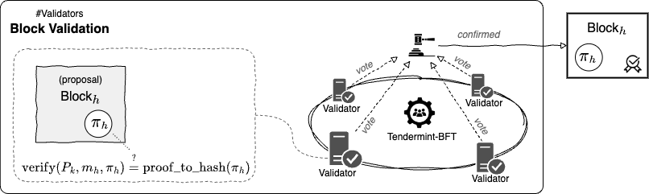
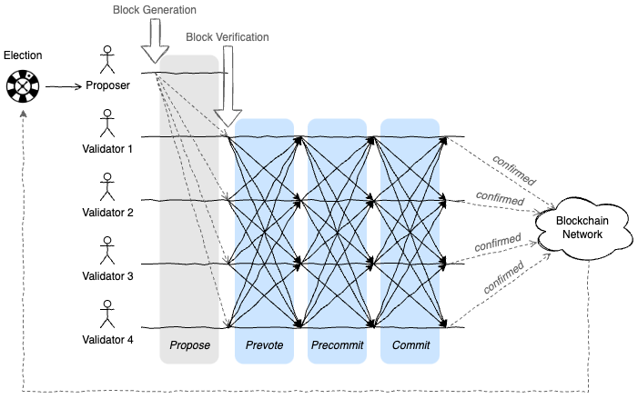

Ostracon は Tendermint-BFT を VRF ベースの選挙で拡張しています。

## コンセンサスプロセス

Tendermint-BFT に基づく Ostracon のブロック生成メカニズムは 3 つのフェーズで構成されています。ここではブロックの世代を*高さ*、以下の 3 つの処理からなる 1 つの承認ラウンドを*ラウンド*と呼んでいます。

### 選挙

Validator ノード (候補ノード) の集合から Proposer を選出する。これはこれは一般的な分散システムにおけるリーダー選挙と同じです。ただし、ブロックチェーンでは悪意を持った妨害によってシステム全体の性能を低下させないために作為的な選出を防ぐように設計する必要があります。また Ostracon の選挙には、公平性を保証するために中央集権的な機関が関与していないことにも注意してください。すべてのノードが選挙結果を決定論的に算出できるため、各ノードは自分が Proposer に選ばれたかを自律的に判断することができます。

### ブロック生成

選出された Proposer はブロックを提案します。まだブロックチェーンに追加されていない未確定のトランザクションはネットワーク上のノードに P2P で共有され、各ノードの mempool と呼ばれる領域に保管されます。Proposer に選ばれたノードは自分の mempool に残っている未承認のトランザクションからブロックを生成して Validator に提案します。

### ブロック検証

Validator は Proposer の提案したブロックを検証します。各 Validator はブロックの内容が正しいかどうかを投票し、Tendermint-BFT はその票を他の Validator に複製します。すべての Validator 数の 2/3 より多い賛成票が集まるとそのブロックは正式に承認されます。一方、定足数に達しない場合は提案されたブロックは却下され選出からやり直し (または投票から再開) されます。

> Tip: Tendermint-BFT では否決の理由に応じてこの再選挙プロセスを特定の段階に振り分けることができます。


## VRF による Proposer 選挙

VRF は暗号論的疑似乱数として使用できるハッシュ値 $t$ を生成するアルゴリズムです。VRF が一般的なハッシュ関数や疑似乱数生成器と異なるのは、秘密鍵の所有者のみがハッシュ値 $t$ を算出でき、対応する公開鍵を持つ人であれば誰でもそのハッシュ値の正しさを検証できる点です。

VRF ハッシュの生成者 $k$ は式 (1) のように自身の秘密鍵 $S_k$ を使ってメッセージ $m$ から証明 (VRF Proof) $\pi$ を生成します。ここでハッシュ値 $t$ は式 (2) を使って証明 $pi$ から生成することができます。一方、検証者はハッシュ値 $t$ が秘密鍵 $S_k$ の所有者によってメッセージ $m$ に基づいて生成されたものであることを検証するために、式 (3) に $S_k$ に対する公開鍵 $P_k$ と $m$, $\pi$ を適用して同一のハッシュ値 $t$ が生成されることを確認します。

```math
\begin{eqnarray}
\pi & = & {\rm vrf\_prove}(S_k, m) \tag{1} \\
t & = & {\rm vrf\_proof\_to\_hash}(\pi) \tag{2}\\
{\rm vrf\_proof\_to\_hash}(\pi) & \overset{\text{?}}{=} & {\rm vrf\_verify}(P_k, m, \pi) \tag{3}
\end{eqnarray}
```

Ostracon では、前のブロックを作成した Proposer からの検証可能な乱数によって次の Proposer を無作為に決定します。ブロックにはそのための VRF Proof フィールド $\pi$ が追加されています。

新しいブロックを受信したノードは選出フェーズを開始します。このフェーズではブロックに含まれている VRF Proof $\pi$ を検証し、「公正な疑似乱数」である VRF ハッシュ $t$ を算出し、その値に基づいてこのラウンドの Proposer 選択します。これは Stake 保有量に応じた選出確率に基づく (つまり PoS に基づく) シンプルで高速な加重ランダムサンプリングによって行われます。


このフェーズで Proposer に選ばれたノードは自身の mempool から未確定のトランザクションを取り出して提案ブロックを作成します (この時点ではまだブロックは確定していません)。次に Proposer は自身を選択した直前の VRF Hash $t$ とブロックの高さ $h$、現在のラウンド $r$ を使って VRF Proof $\pi'$ を算出し、その提案ブロックに設定します。

```math
\begin{eqnarray*}
m_h & = & {\rm SHA256}(h \,\|\, r \,\|\, t_{h-1}) \\
\pi_h & = & {\rm vrf\_prove}(S_i, m_h) \\
t_h & = & {\rm vrf\_proof\_to\_hash}(\pi_h)
\end{eqnarray*}
```

VRF Proof $\pi$ を算出するために使用されるメッセージ $m$ にはそのブロック自身のハッシュ値は含まれないことに注意してください。ブロックを生成する Proposer は試行錯誤によって有利な値を得ることができるため、ブロックのハッシュ値は本質的に安全ではないと考えています。


Validator は受け取った提案ブロックを確認して投票します。票は Tendermint-BFT の prevote、precommit、commit を通じて複製され、定足数以上の有効票が集まればブロックが承認されます。



検証フェーズではブロックの検証に加えて VRF に関する以下の検証も行われます。

- ブロックを生成した Proposer がその直前のブロックの VRF Proof に基づいて選ばれたノードであること。これは実際に VRF ハッシュ $t$ を使って加重ランダムサンプリングで Proposer を選んでブロックを生成したノードと一致しているかで判断できます。
- ブロックに含まれている $\pi$ が本当にその Proposer の秘密鍵を使って生成された VRF Proof であること。VRF Proof $\pi$ から算出した $t$ と、vrf_verify() 関数を使って算出した $t$ が一致していれば $\pi$ が偽造されたものでないと判断できます。

```math
{\rm vrf\_verify}(P_i, m_h, \pi_h) \overset{\text{?}}{=} {\rm vrf\_proof\_to\_hash}(\pi_h)
```

この一連のラウンドを繰り返すことによりすべてのブロック生成に渡る公正なランダムサンプリングを連鎖させることができます。



ここで、ブロックを受信したノードは次の Proposer がどのノードかを決定論的に算出できることを思い出してください。あるラウンドでブロック生成の責任を持つノードを明らかにすることで、選出されながら実際にはその作業を行わなかったり、Eclipse 攻撃のような悪意のある行動を取ったノードに対してペナルティを与えることができます。一方で、次の Proposer は必要最小限の期間しか明らかにならないため、1 ブロックより先の Proposer を予測することは依然として困難です。

## 障害時の対処

### 懲戒制度

Ostracon の合意スキームは少数のノードが故障していても正しく機能しますが、ネットワークや CPU 資源を無駄に消費しないためには故障したノードをコンセンサスに関与させないことが理想的です。特に、一般的な非同期メッセージングの問題に起因しない意図的な不正な行為に対しては、その行為の証拠を共有し、悪意の有無にかかわらず Stake の没収することでコンセンサスグループから排除する措置が取られます。

### リカバリー

このような懲戒制を持つシステムではノードが意図しない動作を起こさない仕組みが重要です。Ostracon は受信したすべてのメッセージを WAL (Write Ahead Log) に記録し、ノード障害から復帰したときに最後に適用したメッセージより後の処理を正しく適用することができます。

WAL に関する詳細は [Tendermint | WAL](https://github.com/tendermint/tendermint/blob/v0.34.x/spec/consensus/wal.md) を参照してください。
