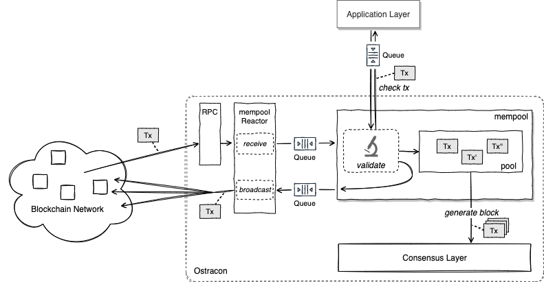

クライアントはブロックチェーンネットワークを構成している Ostracon ノードのいずれかにトランザクションを送信することができます。トランザクションは他の Ostracon ノードに伝搬し最終的にすべての Ostracon ノードで共有されます。

## Mempool

あるブロックが Ostracon のコンセンサス機構によって受理されたとき、そのブロックに含まれているトランザクションは *確定した* とみなされます。未確定のトランザクションは署名などの検証を経てブロックストレージとは別の [**mempool**](https://github.com/tendermint/tendermint/blob/v0.34.x/spec/abci/apps.md#mempool-connection) と呼ばれる領域に保存されます。

また特定の Ostracon ノードが mempool に保存した未確定のトランザクションは他の Ostracon ノードにもブロードキャストされます。ただし、既に受信済みであったり不正なトランザクションの場合には保存やブロードキャストは行われずに破棄されます。このような手法は *gossipping* (または flooding) と呼ばれ、 $N$ を Ostracon ネットワークのノード数として $O(\log N)$ ホップの速度ですべてのノードに到達します。

[リーダー選出](02-consensus.md)によって Proposer に選ばれた Ostracon ノードは mempool に保存されているトランザクションから新しい提案ブロックを生成します。以下の図は Ostracon ノードがトランザクションを受信し mempool に保存してブロック生成に使用されるまでの流れを示しています。

## Performance and Asynchronization

ブロックチェーンの性能はブロックの生成速度が注目されがちですが、現実的なシステムではノード間のトランザクション共有効率も全体の性能に大きく影響する要因です。特に Ostracon の mempool はネットワーク浸透速度の速い gossipping を使用している対価に短時間で大量のトランザクションを処理する必要があります。

Ostracon は Tendermint の Reactor 実装にキューを追加してトランザクションを含むすべての P2P メッセージの処理を非同期で行うように変更しています。この非同期化により現代的な CPU コアを搭載するノードでのトランザクション共有は短時間により多くのトランザクションを mempool に格納することができるようになりネットワークのスループットの限界を改善しています。

この mempool の非同期化に伴って同時に複数のトランザクションが*検証中*の状態を持つようになります。Ostracon は mempool の容量を超過するとトランザクションの受信を拒否しますが、非同期で検証中のトランザクションもこの容量制限の算出に正しく含まれます。

## Tx Validation via ABCI

ABCI (Application Blockchain Interface) はアプリケーションが Ostracon やその他のツールとリモート (gRPC, ABCI-Socket 経由) またはプロセス内 (in-process 経由) で通信するための仕様です。ABCI の詳細については [Tendermint 仕様](https://github.com/tendermint/tendermint/tree/main/spec/abci)を参照してください。

未確定トランザクションの検証過程では ABCI 経由でアプリケーションにも問い合わせを行います。この動作により (データの観点では正しいが) 本質的に不要なトランザクションをブロックに含めないようにアプリケーションが判断することができます。Ostracon ではこのための [CheckTx リクエスト](https://github.com/tendermint/tendermint/blob/main/spec/abci/abci.md#mempool-connection)を非同期化する変更を行い ABCI 側の検証結果を待つことなく次のトランザクションの検証処理を開始できるようにしています。この変更は別のサーバで動作するアプリケーションや、個別の CPU コアが割り当てられているアプリケーション環境でのノードのパフォーマンスを向上させます。

一方この非同期化の副作用として、アプリケーションがある ABCI リクエストの処理を行っている最中に別の CheckTx リクエストを受け付けることになります。例えば LBM SDK の ABCI アプリケーションインターフェース ([BaseApp](https://github.com/line/lbm-sdk/blob/main/baseapp/baseapp.go)) が内部的に保持しているチェック状態はこの並行実行を適切に排他制御する必要があります。このようなロックスコープをアプリケーションレイヤーで適切に設定できるように Ostracon の ABCI は RecheckTx の開始と終了時を通知する API を追加しています。
